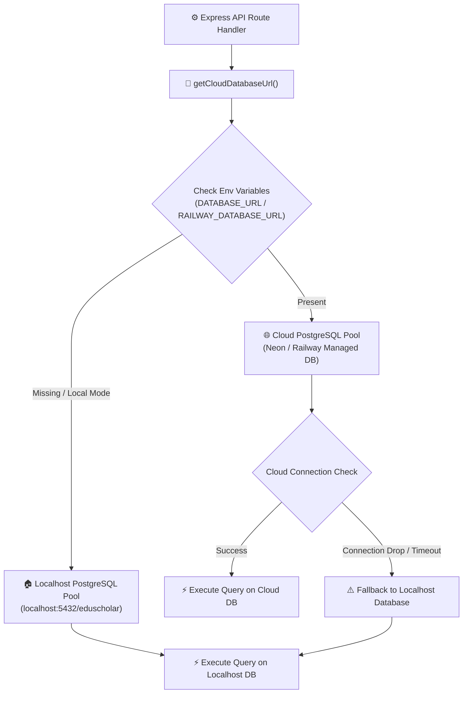
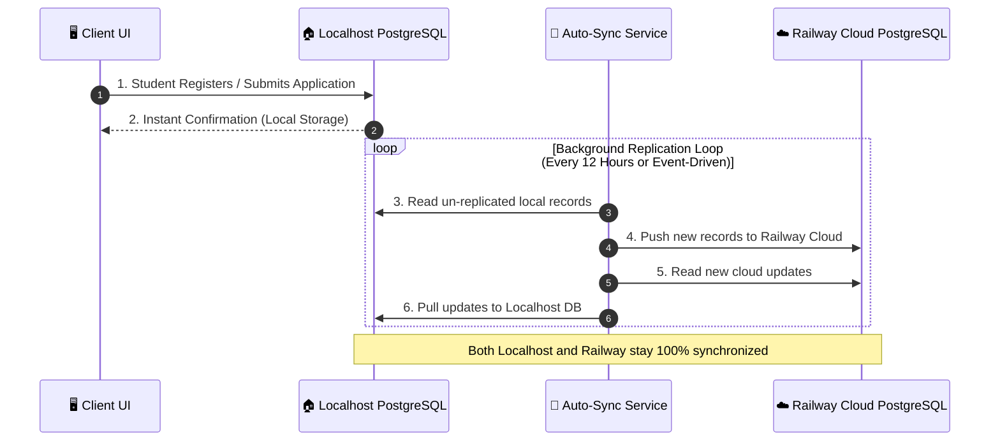

# 🔄 EduScholar Railway ↔ Localhost Fallback Architecture

This document presents the visual diagrams and technical workflow of the **3-Tier Failover and Auto-Sync System** connecting Railway and Localhost.

---

## 1. 🌐 Frontend API Bi-Directional Failover Flow

The Axios API client ([`frontend/src/api/axios.ts`](file:///c:/Users/piama/EduScholar%20Revise/frontend/src/api/axios.ts)) automatically intercepts network errors or server downtime and reroutes requests seamlessly between Localhost and Railway.

```mermaid
flowchart TD
    A["👤 User Action in Web App"] --> B["⚡ Axios Request Interceptor"]
    B --> C{"Check Primary Target"}
    
    C -->|Local Dev (port 5173)| D["Target: http://localhost:5000/api"]
    C -->|Production / Cloud| E["Target: https://eduscholar.up.railway.app/api"]
    
    D --> F{"Backend Online?"}
    E --> G{"Railway Online?"}
    
    F -->|YES| H["✅ Return Data (200 OK)"]
    G -->|YES| H
    
    F -->|NO (ERR_NETWORK / Port 5000 Down)| I["🔀 Auto-Failover to Railway Backend"]
    G -->|NO (502 / 503 / Timeout)| J["🔀 Auto-Failover to Localhost Backend"]
    
    I --> K["https://eduscholar.up.railway.app/api"]
    J --> L["http://localhost:5000/api"]
    
    K --> M["✅ Processed via Railway Fallback"]
    L --> N["✅ Processed via Localhost Fallback"]
```

---

## 2. 🗄️ Backend Database Connection Resilience Flow

The PostgreSQL database pool ([`backend/config/db.js`](file:///c:/Users/piama/EduScholar%20Revise/backend/config/db.js)) resolves database connectivity across Railway, Neon, and Localhost PostgreSQL.



---

## 3. 🔄 Continuous Background Auto-Sync Engine

The background replication service ([`backend/services/autoSyncService.js`](file:///c:/Users/piama/EduScholar%20Revise/backend/services/autoSyncService.js)) keeps Localhost PostgreSQL and Railway PostgreSQL in continuous bi-directional sync.



---

## 🛠️ Summary Matrix

| Layer | Primary Target | Fallback Target | Trigger Condition |
| :--- | :--- | :--- | :--- |
| **Frontend API Client** | Localhost (`:5000`) or Railway | Opposite Target (`Railway` / `Localhost`) | `ERR_NETWORK`, `502`, `503`, `ECONNABORTED` |
| **Database Pool** | Cloud PostgreSQL (`DATABASE_URL`) | Localhost (`localhost:5432/eduscholar`) | Network drop, pool timeout, missing env var |
| **Data Sync Engine** | Localhost DB | Railway Cloud DB | Background interval or `triggerSyncNow()` |
