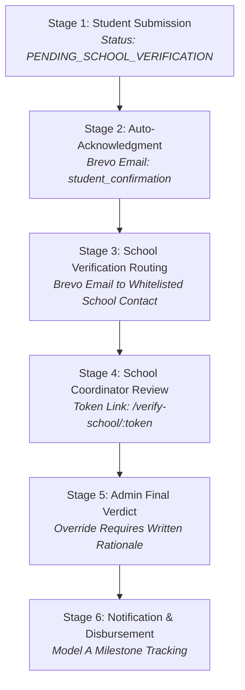

# EduScholar System Workflow & Operational Compliance Guide

## Executive Summary
This document defines the architecture, multi-stage application lifecycle, legal compliance rules, and disbursement tracking mechanisms implemented in the **EduScholar System** (`eduscholar.up.railway.app`).

---

## 🏛️ 1. Restricted Partner School Whitelist
All application forms, dropdowns, candidate profiles, partner database views, and backend validation models are strictly restricted to **ONLY** the following 3 accredited partner institutions:

| Institution Name | Short Name | Official Verification Email | Institution Type |
| :--- | :---: | :--- | :---: |
| **Bestlink College of the Philippines** | BCP | `bcp.edu67@gmail.com` | Private |
| **Quezon City University** | QCU | `qcu.edu67@gmail.com` | LUC |
| **St. Claire College of Caloocan** | St. Claire | `stclaire.edu67@gmail.com` | Private |

---

## 🔄 2. The 6-Stage Core Workflow Architecture



---

## 📋 3. Detailed Stage Breakdown

### Stage 1: Student Submission
- **Route / Interface**: `/apply` or `/student/application-form`
- **Application Status**: `PENDING_SCHOOL_VERIFICATION`
- **Validation**: Server-side required field validation, document file type and size verification.
- **Data Privacy Consent (RA 10173)**: Unchecked mandatory consent checkbox:
  > *"I authorize EduScholar to share my application data with my specified school for verification purposes."*
- **Audit Logging**: Captures IP address, user-agent, timestamp, and applicant ID in `audit_logs`.

---

### Stage 2: Automated Student Acknowledgment (Brevo)
- **Trigger**: Successful Stage 1 submission.
- **Recipient**: Applicant's personal email address.
- **Template**: `student_confirmation`
- **Content**: Reference ID, confirmation of uploaded attachments, next steps, and expected timeline (7–10 working days).

---

### Stage 3: School Verification Request (Brevo)
- **Trigger**: Completion of Stage 2.
- **Recipient**: Designated partner school email (`bcp.edu67@gmail.com`, `qcu.edu67@gmail.com`, or `stclaire.edu67@gmail.com`).
- **Template**: `school_verification_request`
- **Application Status**: `AWAITING_SCHOOL_RESPONSE`
- **Authentication**: Unique 72-hour expiring verification token URL (`https://eduscholar.up.railway.app/verify-school/:token`).
- **Legal Compliance**: Includes mandatory FERPA / Data Privacy **Confidentiality Notice**:
  ```text
  --------------------------------------------------------------------------------
  CONFIDENTIALITY NOTICE: This email contains student education records
  and is intended solely for the designated school official. If you are
  not the intended recipient, please notify the sender immediately and
  delete this message.
  --------------------------------------------------------------------------------
  ```

---

### Stage 4: School Coordinator Review
- **Interface**: Secure public portal route `/verify-school/:token`
- **Application Status**: `PENDING_ADMIN_REVIEW`
- **Coordinator Action**: School official inspects candidate details (Name, Student ID, Course, GWA).
- **Verdict Choices**:
  1. **APPROVE**: Confirms student is enrolled & in good academic standing.
  2. **REJECT**: Student is not enrolled or disqualified.
  3. **REQUEST_MORE_INFO**: Asks student for updated grades or documents.
- **Audit Trail**: Logs coordinator ID, verdict, notes, and timestamp.

---

### Stage 5: System Admin Final Verdict
- **Interface**: Admin Evaluation Desk (`/admin/review-queue`)
- **Application Status**: `DECISION_MADE` (`AWARDED`, `WAITLISTED`, or `DENIED`)
- **Review Protocol**: Admin reviews raw credentials + **Stage 4 Coordinator Recommendation**.
- **Segregation of Duties Enforcement**: Admin **CANNOT** override a coordinator's recommendation without entering a mandatory documented written rationale in Evaluator Notes.
- **Audit Trail**: Logs admin ID, final verdict, written rationale, and timestamp.

---

### Stage 6: Notification & Model A Disbursement Tracking
- **Student Notification**: Brevo sends `student_decision` email to the applicant containing final resolution and board rationale.
- **Model A Disbursement Tracking**: EduScholar tracks financial milestone states without directly holding funds:
  $$\text{PENDING} \longrightarrow \text{ELIGIBLE} \longrightarrow \text{SCHEDULED} \longrightarrow \text{PROCESSING} \longrightarrow \text{RELEASED} \longrightarrow \text{RECONCILED}$$
- **Two-Person Approval Rule**: Initiator and approver must be distinct individuals (`initiator !== approver`).

---

## 🛡️ 4. Legal & Operational Compliance Summary

1. **Separation of Duties**: No single actor has unilateral authority to apply, verify, approve, and disburse funds.
2. **Audit Retention**: Immutable audit trail retaining all state changes for a minimum of 7 years (BIR compliance).
3. **Data Privacy (RA 10173)**: Unchecked consent checkboxes, expiring token links, and sitewide legal routes (`/privacy`, `/terms`, `/refund-policy`, `/cookies`).
