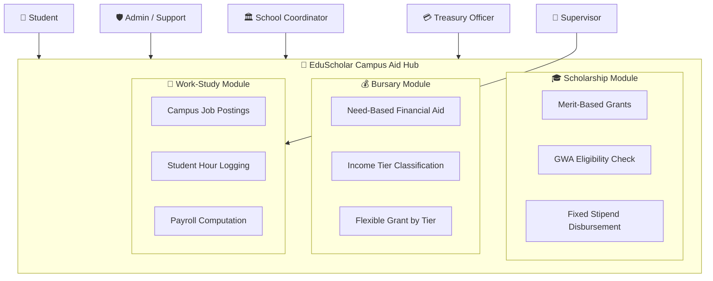
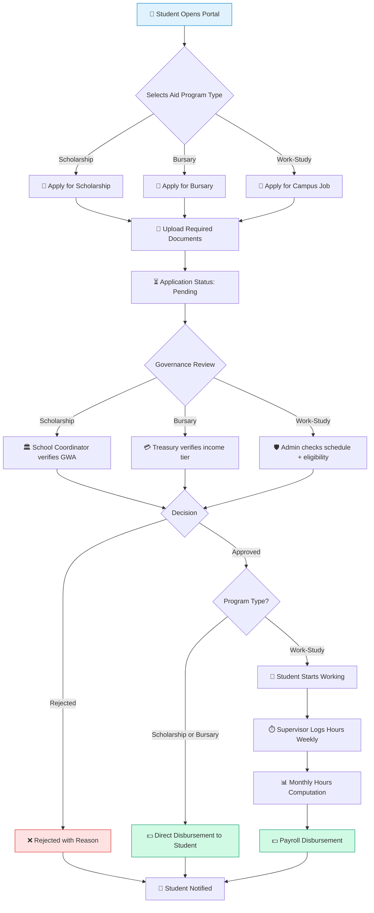
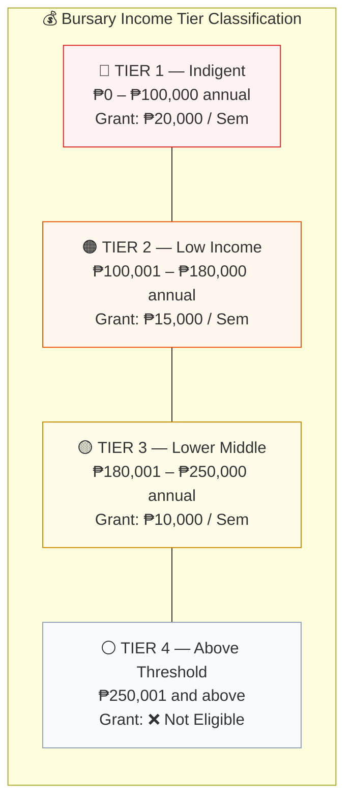
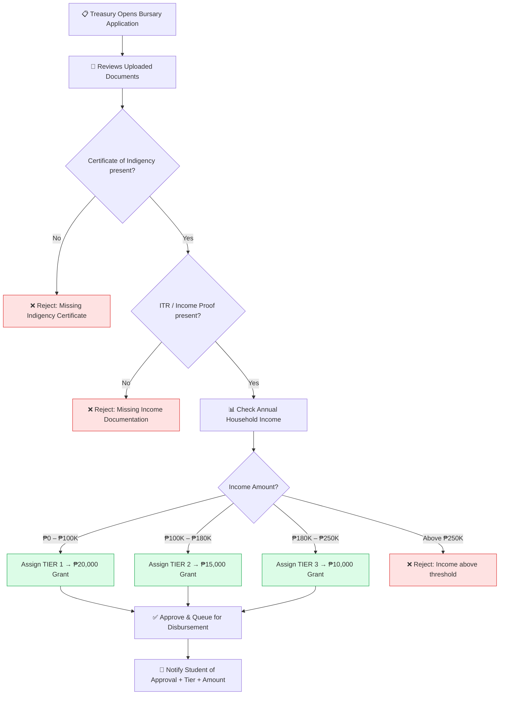
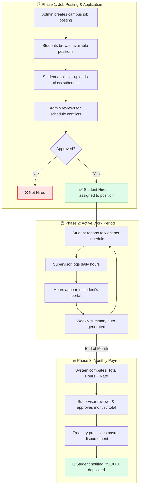
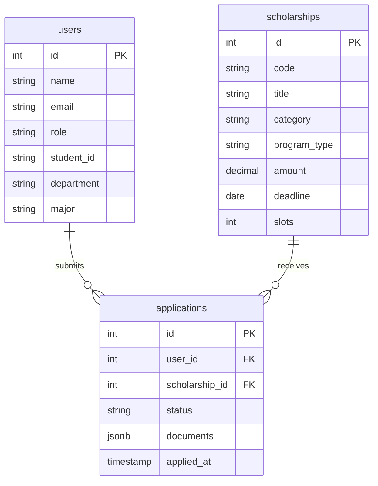
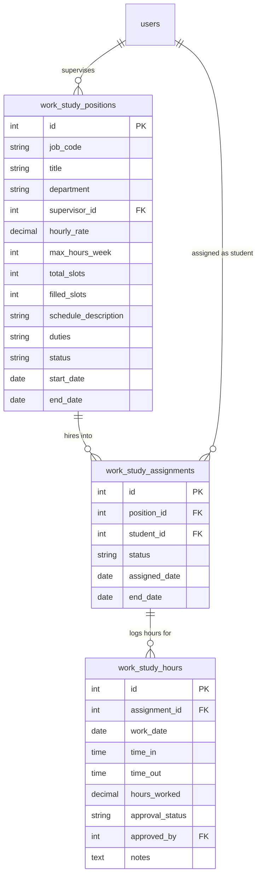
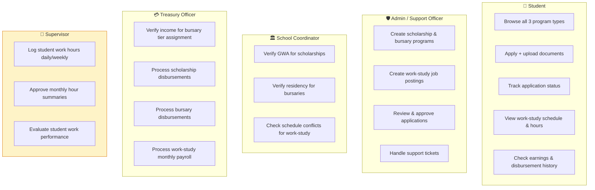
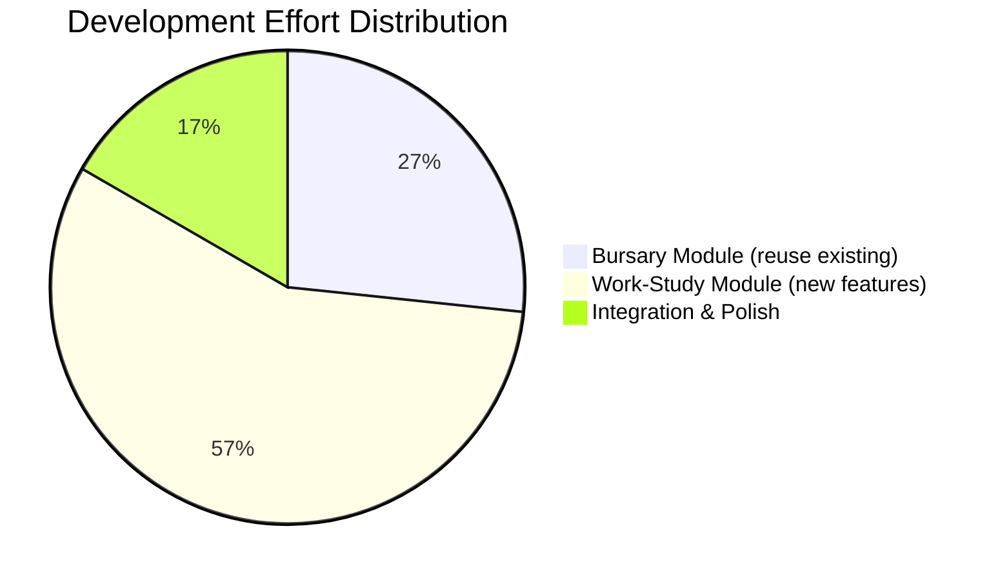

# 📘 EduScholar — Bursary & Work-Study Implementation Plan

## Thesis Title
> **"Design and Implementation of Campus Aid Hub: A Unified Scholarship, Bursary and Work-Study Opportunity Portal for Diverse Student Populations"**

---

## 1. System Overview — The Unified Campus Aid Hub

The EduScholar portal unifies **three distinct financial aid programs** under one governance platform. Each program serves a different student need but shares the same infrastructure.



---

## 2. How the Three Programs Compare

| Feature | 🎓 Scholarship | 💰 Bursary | 💼 Work-Study |
|---|---|---|---|
| **Basis** | Academic merit (GWA) | Financial need (family income) | Earning through campus work |
| **Eligibility** | GWA ≥ 1.75 | Household income ≤ ₱250,000/yr | Enrolled ≥ 15 units + available schedule |
| **Key Documents** | Grade sheets, Good Moral | Certificate of Indigency, ITR | Class schedule, Enrollment cert |
| **Who Reviews** | School Coordinator | Treasury Officer | Admin + Supervisor |
| **Payout Model** | Fixed amount per semester | Tiered amount by income bracket | Hourly rate × hours worked |
| **Example Amount** | ₱25,000 / Sem | ₱8,000–₱20,000 / Sem (by tier) | ₱120/hr × 60 hrs = ₱7,200/mo |
| **Already Built?** | ✅ Yes | 🟡 90% reusable | 🟡 70% reusable + new features |

---

## 3. Unified Application Flow — All Three Programs

This is the key insight: **all three programs share the same core application pipeline**. Work-Study just adds extra steps after approval.



> [!IMPORTANT]
> Notice how steps A → D → E → F → H are **identical** for all three programs. The only difference is **who reviews** and **what happens after approval**.

---

## 4. Bursary Module — Detailed Breakdown

### 4.1 What Makes Bursary Different from Scholarship?

Think of it this way:
- **Scholarship** asks: *"How smart are you?"* (checks GWA)
- **Bursary** asks: *"How much does your family earn?"* (checks income)

The **application form is the same**. The **review criteria is different**.

### 4.2 Income Tier Classification System

Students are classified into income tiers based on their family's **Annual Household Income**. Each tier receives a different grant amount:



### 4.3 Bursary Document Requirements

| Document | Purpose | Who Verifies |
|---|---|---|
| Certificate of Indigency | Proves low-income status from barangay | Treasury Officer |
| Latest ITR (Income Tax Return) | Shows actual family annual income | Treasury Officer |
| Proof of Residency (Barangay ID) | Confirms QC residency | School Coordinator |
| Student Enrollment Certificate | Confirms active enrollment | System (auto-check) |

### 4.4 How Treasury Reviews a Bursary Application



### 4.5 Bursary Student Dashboard View (UI Concept)

What the student would see on their dashboard after applying for a bursary:

```
┌──────────────────────────────────────────────────────────────┐
│  💰 Bursary Application — QCU Need-Based Financial Aid 2026 │
├──────────────────────────────────────────────────────────────┤
│                                                              │
│  Program Code:   QCU-BUR-2026                                │
│  Applied On:     Sep 28, 2026                                │
│  Status:         ✅ APPROVED — Tier 2                        │
│                                                              │
│  ┌────────────────────────────────────────────────────┐      │
│  │  Income Classification:  Tier 2 (Low Income)       │      │
│  │  Annual Household Income: ₱142,000                 │      │
│  │  Grant Amount Awarded:   ₱15,000 / Semester        │      │
│  └────────────────────────────────────────────────────┘      │
│                                                              │
│  Documents Status:                                           │
│   ✅ Certificate of Indigency     — Verified                 │
│   ✅ Income Tax Return (ITR)      — Verified                 │
│   ✅ Barangay Residency ID        — Verified                 │
│   ✅ Enrollment Certificate       — Auto-verified            │
│                                                              │
│  Progress: ████████████████████████████████████████ 100%     │
│                                                              │
│  Disbursement: Queued for Oct 15, 2026 payout cycle          │
└──────────────────────────────────────────────────────────────┘
```

---

## 5. Work-Study Module — Detailed Breakdown

### 5.1 What Makes Work-Study Unique?

Unlike scholarships and bursaries (where you apply and receive money), work-study has an **ongoing cycle**:

1. Student **applies** for a campus job
2. Gets **approved/hired**
3. **Works** on campus (library, lab, admin office)
4. Supervisor **logs their hours** each week
5. At end of month, system **calculates pay**
6. Treasury **disburses** the payroll

### 5.2 Work-Study Complete Lifecycle



### 5.3 Campus Job Posting — What It Looks Like

When an admin creates a work-study position:

```
┌──────────────────────────────────────────────────────────────┐
│  💼 Campus Job Posting                                       │
├──────────────────────────────────────────────────────────────┤
│                                                              │
│  Position:        Library Student Assistant                  │
│  Department:      University Main Library                    │
│  Job Code:        WS-LIB-2026-001                            │
│  Supervisor:      Ms. Rosario Mercado (Librarian III)        │
│                                                              │
│  ┌──────────────────────────────────────────────┐            │
│  │  💰 Rate:       ₱120 / hour                  │            │
│  │  ⏰ Hours:      12–20 hrs/week               │            │
│  │  📅 Schedule:   Mon-Wed-Fri, 1:00–5:00 PM    │            │
│  │  👥 Slots:      3 positions available         │            │
│  │  📆 Duration:   Sep 2026 – Jan 2027 (1 Sem)  │            │
│  └──────────────────────────────────────────────┘            │
│                                                              │
│  Duties:                                                     │
│   • Assist students in book returns and shelving             │
│   • Maintain library catalog and digital records             │
│   • Monitor reading area during assigned shifts              │
│                                                              │
│  Requirements:                                               │
│   ✦ Enrolled at least 15 units                               │
│   ✦ No class conflict with work schedule                     │
│   ✦ Good academic standing (no failing grades)               │
│                                                              │
│              ┌─────────────────────┐                         │
│              │   📝 Apply for Job  │                         │
│              └─────────────────────┘                         │
└──────────────────────────────────────────────────────────────┘
```

### 5.4 Work-Study Hours Logging — The Supervisor View

This is the **key new feature** that doesn't exist in scholarships or bursaries. Here's exactly what it would look like:

```
┌──────────────────────────────────────────────────────────────┐
│  ⏱️ Work-Study Hours Log — September 2026                    │
│  Supervisor: Ms. Rosario Mercado | Library Department        │
├──────────────────────────────────────────────────────────────┤
│                                                              │
│  Student: Juan Dela Cruz (2026-10492)                        │
│  Position: Library Assistant | Rate: ₱120/hr                 │
│                                                              │
│  ┌──────────┬──────────┬──────────┬───────┬─────────┐       │
│  │   Date   │ Time In  │ Time Out │ Hours │ Status  │       │
│  ├──────────┼──────────┼──────────┼───────┼─────────┤       │
│  │ Sep 23   │ 1:00 PM  │ 5:00 PM  │  4.0  │ ✅ Apvd │       │
│  │ Sep 25   │ 1:00 PM  │ 5:00 PM  │  4.0  │ ✅ Apvd │       │
│  │ Sep 27   │ 1:00 PM  │ 4:30 PM  │  3.5  │ ✅ Apvd │       │
│  │ Sep 29   │ 1:00 PM  │ 5:00 PM  │  4.0  │ ⏳ Pend │       │
│  │ Sep 30   │  — —     │  — —     │  — —  │ 📝 Log  │       │
│  └──────────┴──────────┴──────────┴───────┴─────────┘       │
│                                                              │
│  ┌──────────────────────────────────────────────┐            │
│  │  📊 September Summary                        │            │
│  │                                               │            │
│  │  Total Hours Logged:     55.5 hrs             │            │
│  │  Hours Approved:         51.5 hrs             │            │
│  │  Hours Pending:           4.0 hrs             │            │
│  │                                               │            │
│  │  💰 Estimated Payout:    ₱6,180               │            │
│  │     (51.5 approved hrs × ₱120/hr)             │            │
│  └──────────────────────────────────────────────┘            │
│                                                              │
│  [ ✅ Approve All Pending ]  [ 📤 Submit to Treasury ]       │
└──────────────────────────────────────────────────────────────┘
```

### 5.5 Work-Study Student View — Monthly Earnings

What the **student** sees on their dashboard:

```
┌──────────────────────────────────────────────────────────────┐
│  💼 My Work-Study — Library Assistant                        │
├──────────────────────────────────────────────────────────────┤
│                                                              │
│  Position:     Library Student Assistant                     │
│  Supervisor:   Ms. Rosario Mercado                           │
│  Status:       🟢 Currently Active                           │
│                                                              │
│  ┌──────────────────────────────────────────────┐            │
│  │   This Month (September 2026)                 │            │
│  │                                               │            │
│  │   Hours Worked:   55.5 hrs                    │            │
│  │   Hours Approved: 51.5 hrs                    │            │
│  │   Hourly Rate:    ₱120                        │            │
│  │   ─────────────────────────────               │            │
│  │   💰 Estimated Pay: ₱6,180                    │            │
│  │   📅 Payout Date:   Oct 5, 2026               │            │
│  └──────────────────────────────────────────────┘            │
│                                                              │
│  📈 Earnings History:                                        │
│  ┌─────────────┬────────┬──────────┬───────────┐            │
│  │    Month    │ Hours  │  Amount  │  Status   │            │
│  ├─────────────┼────────┼──────────┼───────────┤            │
│  │ August 2026 │ 60 hrs │ ₱7,200   │ ✅ Paid   │            │
│  │ July 2026   │ 48 hrs │ ₱5,760   │ ✅ Paid   │            │
│  └─────────────┴────────┴──────────┴───────────┘            │
│                                                              │
│  Total Earned This Semester: ₱19,140                         │
└──────────────────────────────────────────────────────────────┘
```

---

## 6. Database Design — What Tables You Need

### 6.1 Current Tables (Already Exist)

These tables already power your scholarship module and will be **reused**:



### 6.2 New Tables Needed

Only **3 new tables** for the complete work-study module:



### 6.3 Bursary — No New Tables Needed!

For bursary, you just add **2 columns** to your existing `applications` table:

| New Column | Type | Purpose |
|---|---|---|
| `income_tier` | `varchar` | `'Tier 1'`, `'Tier 2'`, `'Tier 3'` or `null` |
| `annual_household_income` | `decimal` | The verified family income amount |

And add `'bursary'` as a valid option in your `scholarships.program_type` column.

**That's it.** No new tables for bursary.

---

## 7. Role Responsibilities Across All Three Programs



> [!NOTE]
> The **Supervisor** role is the only truly new governance actor, and it already exists in your database schema (`role = 'supervisor'`). They are department heads or office managers who oversee work-study students (e.g., the Head Librarian, Lab Director, etc.).

---

## 8. Implementation Phases & Timeline

### Phase 1: Bursary Module (Week 1–2)
> **Effort: Low** — 90% code reuse from scholarships

| Task | Days | Details |
|---|---|---|
| Add `program_type` column to scholarships table | 0.5 | `'scholarship'`, `'bursary'`, `'work_study'` |
| Add `income_tier` + `annual_household_income` to applications | 0.5 | New columns for bursary classification |
| Create bursary program listings in admin panel | 1 | Reuse scholarship creation form with bursary fields |
| Build Bursary browse page for students | 1 | Reuse `ScholarshipsPage.tsx` layout with "Bursary" filter |
| Build bursary application form | 1 | Reuse scholarship apply form, change document checklist |
| Add income tier assignment in Treasury review | 1 | Dropdown: Tier 1/2/3 based on submitted ITR |
| Update dashboard to show bursary applications | 1 | Add "Bursary" tab alongside scholarships |
| **Testing & Polish** | 2 | End-to-end flow testing |
| **Total** | **~8 days** | |

### Phase 2: Work-Study Module (Week 3–5)
> **Effort: Medium** — 70% reuse + new hours logging features

| Task | Days | Details |
|---|---|---|
| Create 3 new database tables | 1 | `work_study_positions`, `assignments`, `hours` |
| Build Work-Study job postings page (student view) | 2 | Card layout with position details, rate, schedule |
| Build Work-Study application flow | 1 | Reuse scholarship apply form + class schedule upload |
| Build Admin: Create/manage job postings | 2 | Form: title, department, rate, hours, slots, supervisor |
| Build Supervisor: Hours logging dashboard | 3 | Time-in/time-out entries, weekly view, approve buttons |
| Build Student: My work-study hours view | 2 | View logged hours, monthly summary, earnings history |
| Build Treasury: Monthly payroll computation | 2 | Auto-calculate: approved hours × rate = payout |
| Notification integration | 1 | Shift reminders, approval notices, payout alerts |
| **Testing & Polish** | 3 | Full lifecycle testing with all roles |
| **Total** | **~17 days** | |

### Phase 3: Integration & Unified Dashboard (Week 6)
> **Effort: Low** — Connecting everything together

| Task | Days | Details |
|---|---|---|
| Unified "My Aid Programs" student dashboard | 2 | Shows all 3 types in one view |
| Combined admin analytics | 1 | Total disbursements across all programs |
| Final QA & demo preparation | 2 | Governance account testing, edge cases |
| **Total** | **~5 days** | |

---

## 9. Summary: Total Effort Breakdown



| Module | Effort | New Code | Reused Code |
|---|---|---|---|
| 💰 Bursary | ~8 days | ~10% | ~90% |
| 💼 Work-Study | ~17 days | ~30% | ~70% |
| 🔗 Integration | ~5 days | ~20% | ~80% |
| **TOTAL** | **~30 days (6 weeks)** | | |

> [!TIP]
> The **Bursary module is your quick win** — it can be demo-ready in 1–2 weeks since it reuses almost everything from scholarships. Start there to show immediate progress, then build Work-Study.
