# EduScholar: Complete Technical Specifications & Architecture Diagrams (Sections 1 – 16)

This document contains the complete, comprehensive technical diagrams and architectural specifications for the **EduScholar System**, tailored to the Quezon City Youth Development Office (QCYDO) scholarship management and institutional reconciliation platform.

---

## 1. System Architecture

### 1.1 Microservices Diagram
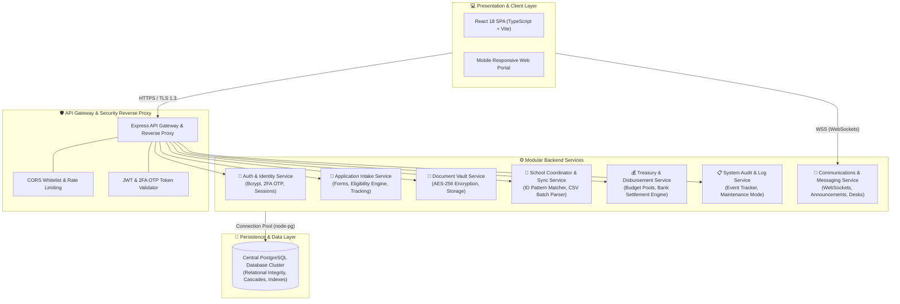

---

### 1.2 Communication Pattern Design
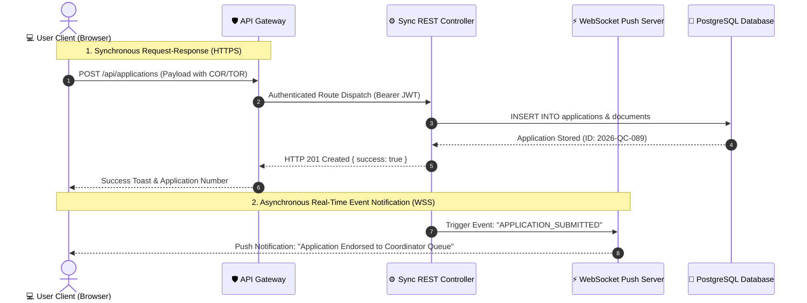

---

### 1.3 Data Flow Diagram for Microservices
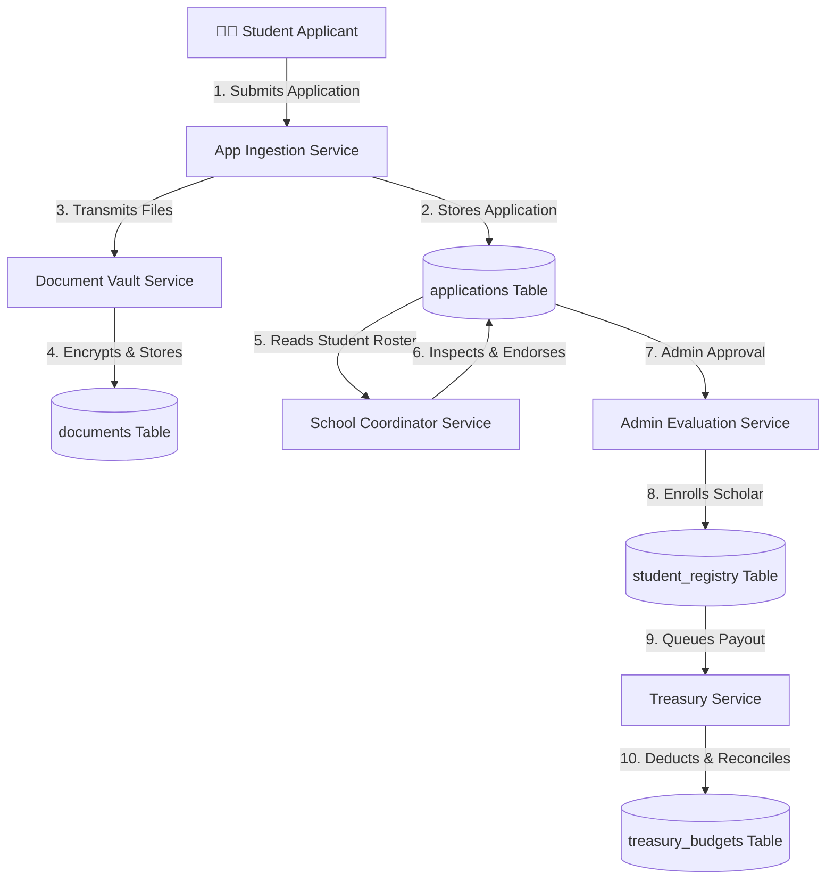

---

### 1.4 API Gateway
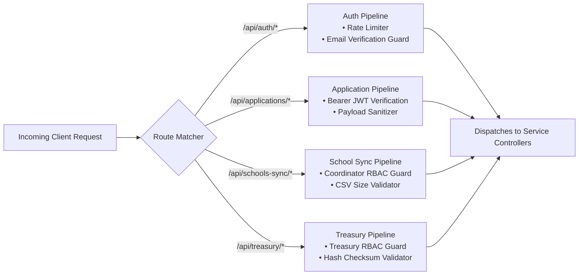

---

### 1.5 Application Architecture
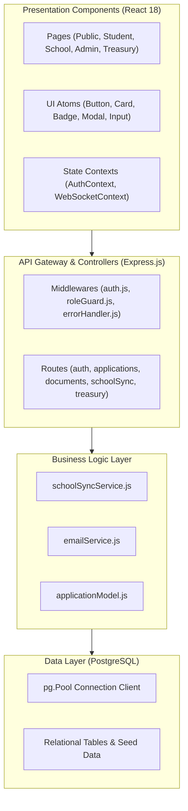

---

### 1.6 Architecture Diagram
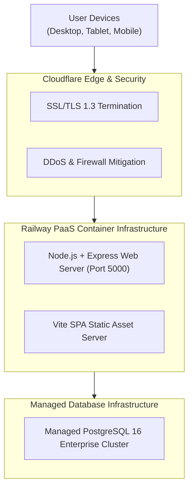

---

### 1.7 Physical View of the Architecture of a Web Application
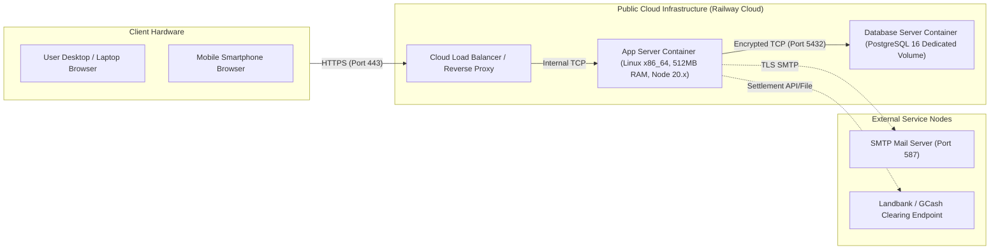

---

### 1.8 Understanding the Architecture 3-Tier
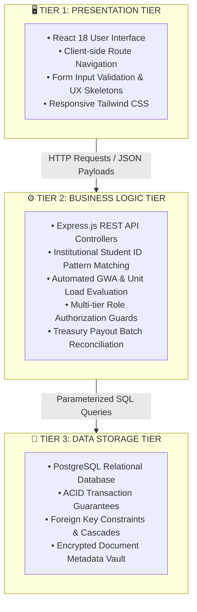

---

## 2. Information Systems Integration

### 2.1 Web Application Data Flow
```mermaid
graph LR
    User["User Action (Submit / Approve)"] --> Form["React Form Component"]
    Form --> Axios["Axios API Client (Token Interceptor)"]
    Axios --> Route["Express Router (/api/...)"]
    Route --> AuthMid["Auth & RBAC Middleware"]
    AuthMid --> Controller["Business Controller Method"]
    Controller --> Model["Database Model Query ($1, $2)"]
    Model --> PG[("PostgreSQL DB")]
    PG -->> Model -->> Controller -->> Axios -->> Form -->> User
```

---

### 2.2 REST API Architecture
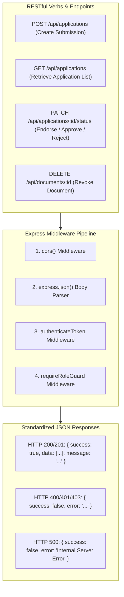

---

### 2.3 Business Process Architecture 1: Application Intake & Institutional Verification
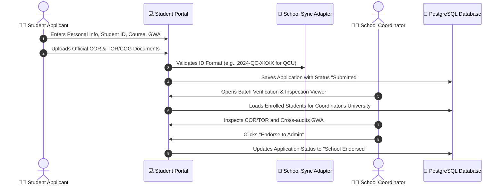

---

### 2.4 Business Process Architecture 2: Approval, Disbursement & Treasury Reconciliation
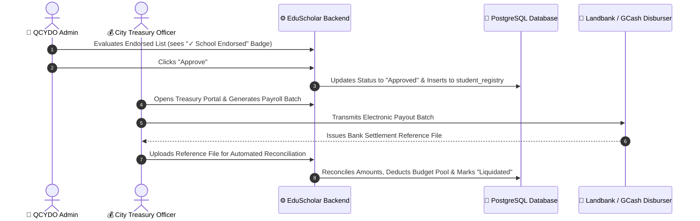

---

## 3. Application Design and Development

### 3.1 Data Flow Diagram Level 0 (Context Diagram)
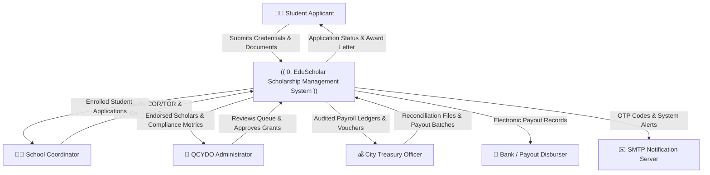

---

### 3.2 Data Flow Diagram Level 1
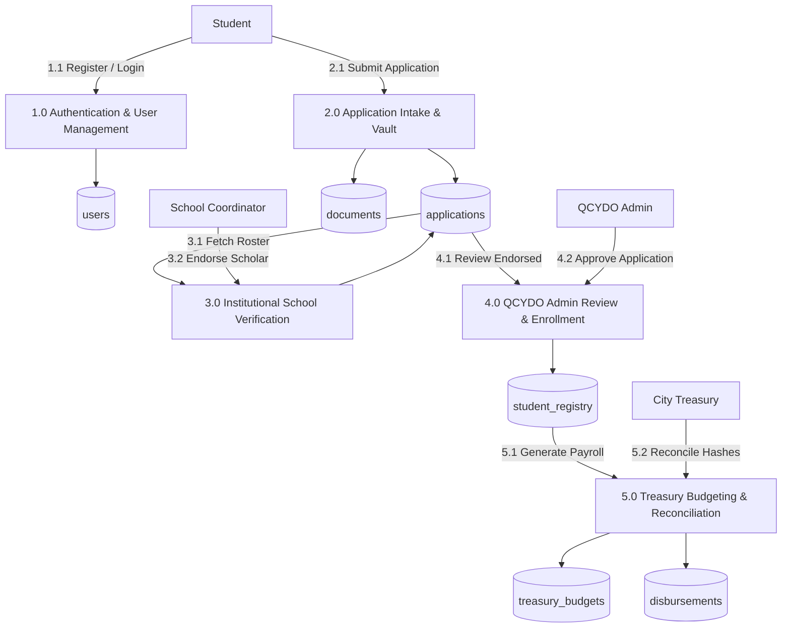

---

### 3.3 Use Case Diagram
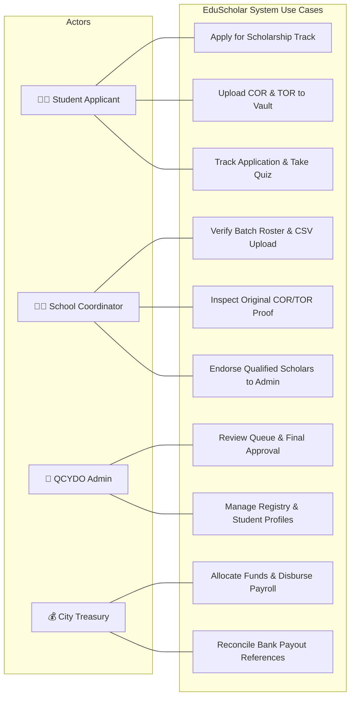

---

### 3.4 Applicant Sequence Diagram
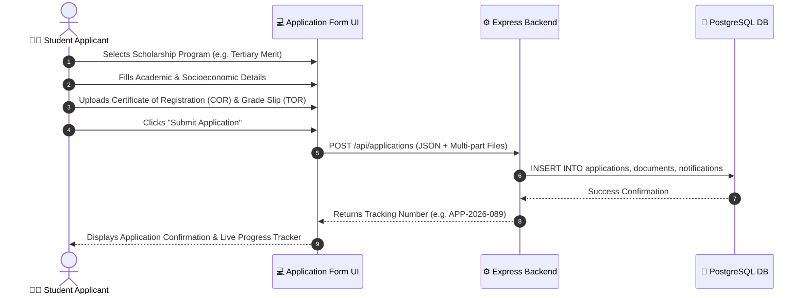

---

### 3.5 School Coordinator Sequence Diagram
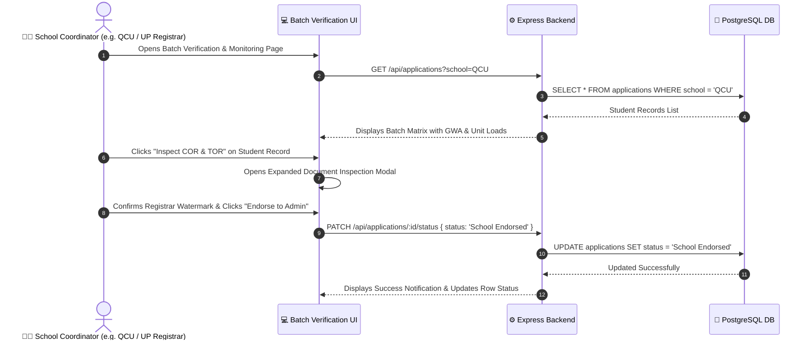

---

### 3.6 Treasury Officer Sequence Diagram
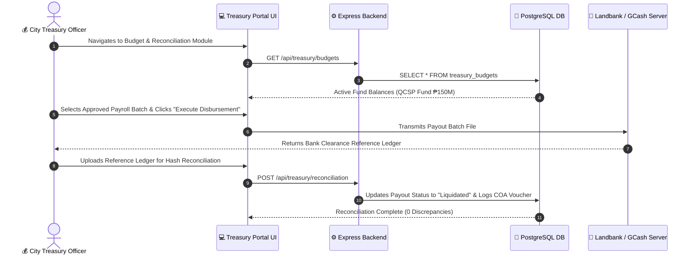

---

### 3.7 Admin Sequence Diagram
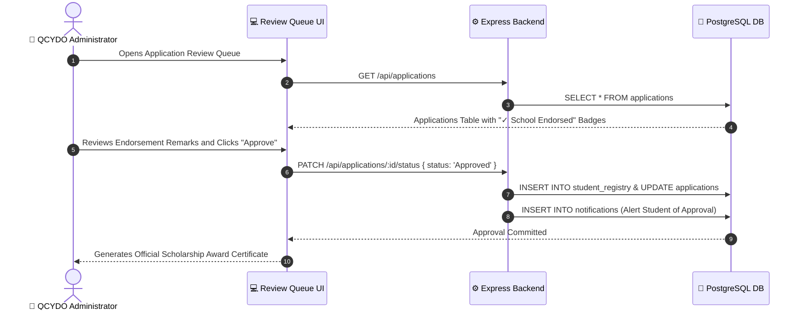

---

### 3.8 Master System Flowchart
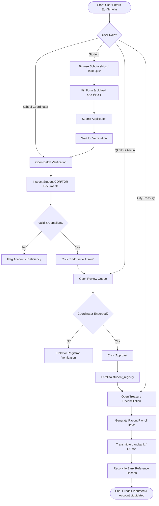

---

## 4. Database Schema and Data Management

### 4.1 Master Entity-Relationship Diagram (ERD)
```mermaid
erDiagram
    USERS ||--o{ APPLICATIONS : submits
    USERS ||--o{ NOTIFICATIONS : receives
    USERS ||--o{ AUDIT_LOGS : performs
    APPLICATIONS ||--o{ DOCUMENTS : contains
    APPLICATIONS ||--o| STUDENT_REGISTRY : enlists
    PROGRAMS ||--o{ APPLICATIONS : categorizes
    TREASURY_BUDGETS ||--o{ DISBURSEMENTS : finances
    CONVERSATIONS ||--o{ CHAT_MESSAGES : contains

    USERS {
        int id PK
        string full_name
        string email
        string password_hash
        string role
        boolean is_verified
        timestamp created_at
    }

    APPLICATIONS {
        int id PK
        int user_id FK
        string application_no
        string program_id FK
        string applicant_name
        string school
        string course
        int year_level
        decimal gwa
        int units_enrolled
        string status
        timestamp submitted_at
    }

    DOCUMENTS {
        int id PK
        int application_id FK
        string doc_type
        string file_name
        string file_url
        string verification_status
        timestamp uploaded_at
    }

    STUDENT_REGISTRY {
        string student_id PK
        int user_id FK
        string full_name
        string school
        string program_name
        decimal grant_amount
        string disbursement_status
    }

    TREASURY_BUDGETS {
        int id PK
        string fund_name
        string fiscal_year
        decimal total_allocation
        decimal disbursed_amount
        string status
    }

    DISBURSEMENTS {
        int id PK
        int budget_id FK
        string batch_no
        string payout_channel
        decimal total_amount
        string reconciliation_status
    }
```

---

## 5. Network Configuration

### 5.1 Network Topology Diagram
```mermaid
graph TD
    subgraph PublicInternet["🌍 Public Internet"]
        Users["Student & Coordinator Devices"]
    end

    subgraph EdgeSecurityZone["🛡️ Edge Security Zone (Cloudflare / SSL)"]
        WAF["Web Application Firewall (WAF)"]
        SSLTermination["TLS 1.3 Encryption Termination"]
        WAF --- SSLTermination
    end

    subgraph ApplicationZone["⚙️ Private Application VPC (Railway Cloud)"]
        ReverseProxy["Nginx / Internal Reverse Proxy"]
        NodeApp["Express.js Application Server (Port 5000)"]
        WSServer["WebSocket Push Daemon (Port 5000)"]
        ReverseProxy --> NodeApp
        ReverseProxy --> WSServer
    end

    subgraph DataZone["🔒 Isolated Data Subnet (No Public IP)"]
        PGDB[("PostgreSQL 16 Database Cluster (Port 5432)")]
    end

    PublicInternet -->|"HTTPS (Port 443)"| EdgeSecurityZone
    EdgeSecurityZone -->|"Encrypted Tunnel"| ApplicationZone
    ApplicationZone -->|"Internal Private IP (10.0.x.x)"| DataZone
```

---

## 6. Deployment and Infrastructure

### 6.1 Infrastructure as Code (IaC) Architecture
```mermaid
graph LR
    subgraph SourceControl["1. Git Repository"]
        Code["Source Code (React + Express)"]
        NixpacksConfig["nixpacks.toml (Build Specifications)"]
        DockerConfig["Dockerfile (Container Runtime)"]
        RailwayConfig["railway.json (Deployment Manifest)"]
    end

    subgraph OrchestrationEngine["2. Automated IaC Builder"]
        Builder["Railway Nixpacks Engine<br/>• Installs Node 20.x<br/>• Executes 'npm run build'<br/>• Generates Production Dist"]
    end

    subgraph ProductionCluster["3. Container Runtime Environment"]
        AppPod["Production Web Pod (Auto-restart, Health Check)"]
        PostgresPod["PostgreSQL Managed Pod (Automatic Backups, WAL)"]
        AppPod --> PostgresPod
    end

    SourceControl -->|"Git Push Webhook"| OrchestrationEngine
    OrchestrationEngine -->|"Provisions Container Image"| ProductionCluster
```

---

## 7. Security Measures

### 7.1 Security Architecture Diagram
```mermaid
graph TD
    Request["Incoming User Request"]

    subgraph PerimeterDefense["1. Perimeter & Transport Security"]
        TLS["HTTPS TLS 1.3 Transport Encryption"]
        CORS["Strict CORS Origin Whitelist"]
        RateLimit["IP Rate Limiting & DoS Protection"]
    end

    subgraph IdentitySecurity["2. Identity & Access Management (IAM)"]
        Bcrypt["Bcrypt Password Salt & Hash (Cost Factor 10)"]
        OTP["6-Digit One-Time Password (2FA Email OTP)"]
        JWTTokens["Signed JSON Web Tokens (HMAC-SHA256)"]
    end

    subgraph ApplicationSecurity["3. Application & Data Security"]
        RBAC["Role-Based Route Guards (Student, School, Admin, Treasury)"]
        SQLParam["Parameterized SQL Queries (100% Anti-SQL Injection)"]
        AES["AES-256 Document Encryption at Rest"]
    end

    Request --> PerimeterDefense
    PerimeterDefense --> IdentitySecurity
    IdentitySecurity --> ApplicationSecurity
    ApplicationSecurity --> AuthorizedAccess["✅ Authorized Operation Executed"]
```

---

## 8. Testing and Quality Assurance

### 8.1 Testing Process Flowchart
```mermaid
flowchart LR
    DevCommit["Developer Code Modification"] --> StaticAnalysis["1. TypeScript Static Analysis (tsc -b)"]
    StaticAnalysis --> TypeCheck{Passes Types?}
    TypeCheck -->|No| FixType["Fix TypeScript Typing Error"] --> StaticAnalysis
    TypeCheck -->|Yes| BundlerTest["2. Vite Tree-Shaking & Minification Build"]
    BundlerTest --> BuildCheck{Build Exit Code 0?}
    BuildCheck -->|No| FixBuild["Resolve Module Conflict"] --> BundlerTest
    BuildCheck -->|Yes| E2EVerification["3. Multi-Tier End-to-End Test<br/>(Student ➔ Coordinator ➔ Admin ➔ Treasury)"]
    E2EVerification --> DeployStaging["4. Continuous Staging & Release Deployment"]
```

---

## 9. System Monitoring and Maintenance

### 9.1 Monitoring & Alerting Architecture
```mermaid
graph TD
    subgraph OperationalMonitors["System Monitors"]
        HealthProbe["Server Health Heartbeat (Uptime, Memory)"]
        QueryMonitor["PostgreSQL Connection Pool Status"]
        AuditCollector["Audit Trail Collector (audit_logs Table)"]
    end

    subgraph ProcessingEngine["Event Evaluation Engine"]
        Thresholds{"Resource or Error Alert Triggered?"}
    end

    subgraph MaintenanceControls["Admin Control Actions"]
        MaintToggle["Maintenance Mode Switch<br/>(Displays User Banner, Allows Admin Access)"]
        LogViewer["Live Audit & Error Log Explorer"]
        AdminAlert["Dispatch High Priority Admin Alert"]
    end

    OperationalMonitors --> ProcessingEngine
    ProcessingEngine --> Thresholds
    Thresholds -->|Normal| LogViewer
    Thresholds -->|Critical| AdminAlert
    Thresholds -->|Maintenance Scheduled| MaintToggle
```

---

## 10. APIs and Integration Points

### 10.1 API Integration Topology
```mermaid
graph TD
    Core["EduScholar API Core Gateway"]

    subgraph InternalAPIs["Internal REST Routes"]
        AuthRoute["/api/auth (Login, Register, 2FA OTP)"]
        AppRoute["/api/applications (Intake, Status, Filter)"]
        DocRoute["/api/documents (Upload, Encrypt, Retrieve)"]
        AdminRoute["/api/admin (Registry, Users, Logs, Config)"]
    end

    subgraph ExternalIntegrationAPIs["External & Interoperability Adapters"]
        SchoolSyncRoute["/api/schools-sync/verify/:schoolCode/:studentId (SIS Adapter)"]
        TreasuryRoute["/api/treasury/reconciliation (Bank Settlement Hashes)"]
        CommsRoute["/api/communication (Announcements, Chat, Messages)"]
    end

    Core --- InternalAPIs
    Core --- ExternalIntegrationAPIs
```

---

## 11. User Documentation

### 11.1 User Documentation Structure
```mermaid
graph TD
    UserDocs["EduScholar User Documentation Portal"]

    UserDocs --> StudentDocs["1. Student & Applicant Guides<br/>• Online Application Step-by-step Guide<br/>• Document Vault Upload & Format Requirements<br/>• Tracking Status & Renewal Procedures"]
    
    UserDocs --> CoorDocs["2. School Coordinator Guides<br/>• Batch CSV Enrollment Roster Upload Guide<br/>• Original COR/TOR Inspection Manual<br/>• Academic Endorsement Workflow"]

    UserDocs --> AdminDocs["3. QCYDO Admin Manual<br/>• Application Review Queue & Approval Criteria<br/>• Student Registry Management<br/>• Program & Quota Configuration"]

    UserDocs --> TreasuryDocs["4. City Treasury Manual<br/>• Fund Allocation & Budget Pool Liquidation<br/>• Landbank & GCash Automated Reconciliation Engine"]
```

---

## 12. Known Issues and Troubleshooting

### 12.1 Known Issues and Troubleshooting Lifecycle
```mermaid
graph TD
    IssueTrigger["Issue Encountered by User"] --> Category{"Issue Category"}

    Category -->|Forgot Password / Locked Account| Sol1["Self-Service Password Reset via Email OTP"]
    Category -->|COR/TOR File Too Large / Corrupted| Sol2["Document Vault Re-upload (Max 10MB PDF/PNG/JPG)"]
    Category -->|Coordinator Roster CSV Format Error| Sol3["Download Official CSV Template from Batch Verification Portal"]
    Category -->|Bank Reference Number Hash Mismatch| Sol4["Treasury Manual Exception Review Panel"]

    Sol1 --> TicketDesk["If unresolved: Submit Ticket at /support"]
    Sol2 --> TicketDesk
    Sol3 --> TicketDesk
    Sol4 --> TicketDesk
    TicketDesk --> HelpdeskResolved["QCYDO Technical Team Resolution"]
```

---

## 13. Version Control and Source Code Repository

### 13.1 Version Control Workflow
```mermaid
graph LR
    subgraph LocalDev["Developer Workspace"]
        LocalBranch["Feature Branches<br/>(feat/school-coor, feat/treasury)"]
        LocalTest["Local Build Verification (npm run build)"]
        LocalBranch --> LocalTest
    end

    subgraph RemoteRepo["GitHub Remote Repository (aysedakom/EduScholar)"]
        MainBranch["main Branch (Production Ready)"]
    end

    subgraph CI_Deployment["Automated Deployment Pipeline"]
        Webhook["Railway GitHub Webhook"]
        LiveProd["Live Production App"]
    end

    LocalTest -->|"git push origin main"| MainBranch
    MainBranch -->|"Automatic Trigger"| Webhook
    Webhook --> LiveProd
```

---

## 14. DevOps and Continuous Integration/Continuous Deployment (CI/CD)

### 14.1 Complete CI/CD Pipeline
```mermaid
flowchart TD
    A["Developer Commits Code"] --> B["Git Push to GitHub (main)"]
    B --> C["Railway CI Webhook Triggers"]
    C --> D["Nixpacks Builds Node.js 20 Environment"]
    D --> E["Dependency Resolution: npm install"]
    E --> F["Compile & Bundle: npm run build (tsc -b + Vite)"]
    F --> G{Build Succeeded?}
    G -->|No| H["Build Fails & Alert Sent to Developer"]
    G -->|Yes| I["Deploy Container to Production Cluster"]
    I --> J["Zero-Downtime Traffic Switch"]
    J --> K["System Live on Railway HTTPS Domain"]
```

---

## 15. Licensing and Open-Source Libraries

### 15.1 Open-Source Stack & License Hierarchy
```mermaid
graph TD
    EduScholar["EduScholar Platform (Proprietary to QCYDO / QC LGU)"]

    subgraph FrontendLibraries["Frontend Open Source Dependencies"]
        React["React 18 & ReactDOM (MIT License)"]
        TS["TypeScript (Apache 2.0 License)"]
        Tailwind["Tailwind CSS (MIT License)"]
        Lucide["Lucide React Icons (ISC License)"]
        Vite["Vite Build Tool (MIT License)"]
        Sonner["Sonner Toast Engine (MIT License)"]
    end

    subgraph BackendLibraries["Backend Open Source Dependencies"]
        NodeJS["Node.js Runtime (MIT License)"]
        Express["Express.js Framework (MIT License)"]
        PG["node-postgres (MIT License)"]
        Bcrypt["bcryptjs (MIT License)"]
        JWT["jsonwebtoken (MIT License)"]
        WS["ws WebSocket Library (MIT License)"]
    end

    EduScholar --- FrontendLibraries
    EduScholar --- BackendLibraries
```

---

## 16. Performance Metrics and Monitoring

### 16.1 Performance Metrics & Telemetry Loop
```mermaid
graph TD
    subgraph ClientOptimization["Client-Side Metrics"]
        BundleSize["Vite Code Splitting (<500 kB per chunk)"]
        AssetCompress["Gzip Compression (~20 kB CSS)"]
        FirstPaint["First Contentful Paint (FCP) < 1.0s"]
    end

    subgraph ServerOptimization["Server & Database Metrics"]
        QueryIndex["B-Tree Indexes on student_id, user_id, application_no"]
        PoolReuse["Connection Pooling (Low latency reuse)"]
        AsyncIO["Non-blocking Async I/O Controllers"]
    end

    subgraph TelemetryAnalytics["Live Analytics & Dashboard (/admin/analytics)"]
        AppThroughput["Application Processing Throughput"]
        ApprovalVelocity["Endorsement to Approval Velocity (in Days)"]
        BudgetUtil["Real-time Treasury Budget Utilization Gauge"]
    end

    ClientOptimization --> TelemetryAnalytics
    ServerOptimization --> TelemetryAnalytics
```
