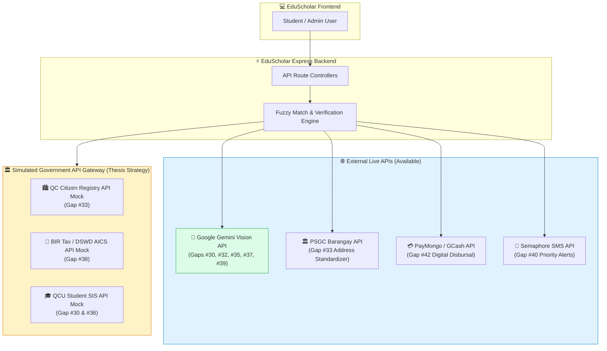
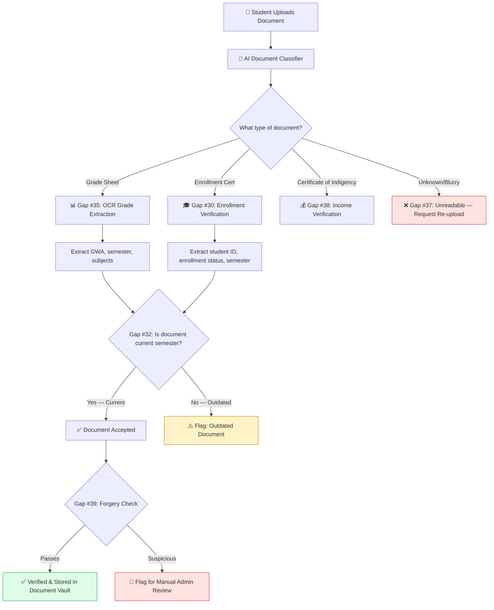
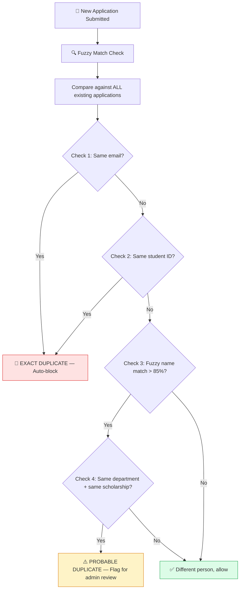
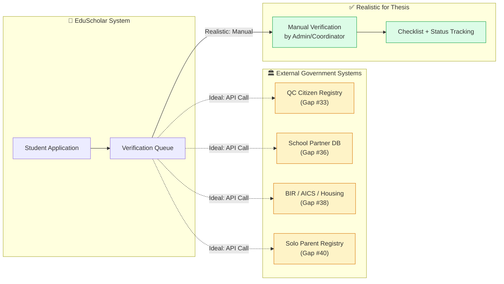
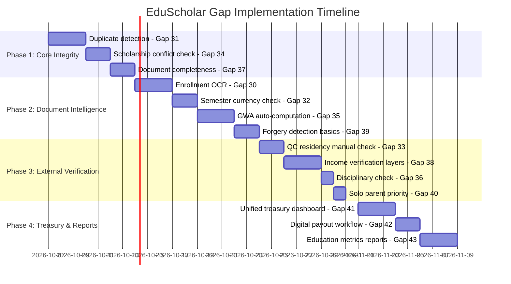

# 📋 EduScholar — Gap Analysis & Implementation Plan (Items #30–43)

> These gaps represent **verification & automation features** that strengthen the credibility of EduScholar as a genuine governance-grade financial aid system.

---

## Quick Reference — All 14 Gaps at a Glance (with Public API Strategy)

| # | Gap | Category | Public API / Technology | Feasibility | Priority |
|---|---|---|---|---|---|
| 30 | Enrollment verification → Student Registry + Document OCR | 📄 Document Verification | **Gemini Vision API** / Tesseract OCR | 🟢 High | 🔴 High |
| 31 | Duplicate application detection → AI fuzzy matching | 🔍 Application Integrity | **Levenshtein / Fuse.js** (Internal API) | 🟢 High | 🔴 High |
| 32 | Document currency check → OCR semester extraction | 📄 Document Verification | **Gemini Vision API** (Date Parser) | 🟢 High | 🟡 Medium |
| 33 | QC residency verification → Citizen Registry System | 🏛️ External Registry | **PSGC API** + Mock Gov Gateway API | 🟡 API Mock | 🟡 Medium |
| 34 | Previous scholarship conflict → Financial Aid Disbursement System | 🔍 Application Integrity | **EduScholar Internal REST API** | 🟢 High | 🔴 High |
| 35 | Academic standing beyond GWA → OCR grade extraction + auto-computation | 📄 Document Verification | **Gemini Vision API** (Structured JSON) | 🟢 High | 🟡 Medium |
| 36 | Disciplinary record check → Partner School Database / Student Registry | 🏛️ External Registry | **Mock SIS API Gateway** | 🟡 API Mock | 🟢 Low |
| 37 | Document completeness & readability → AI document classification | 📄 Document Verification | **Gemini Vision API** (Classification) | 🟢 High | 🟡 Medium |
| 38 | Income/financial need verification → Real Property Tax + AICS + Housing Registry | 🏛️ External Registry | **Mock DSWD/BIR API Gateway** + OCR | 🟡 API Mock | 🔴 High |
| 39 | Document forgery detection → AI tampering analysis | 📄 Document Verification | **Gemini Vision API** (Forensic Inspection) | 🟢 High | 🟡 Medium |
| 40 | Solo parent / special priority status → Solo Parent & Child Welfare System | 🏛️ External Registry | **Semaphore SMS API** + Manual Audit | 🟢 High | 🟢 Low |
| 41 | Unified treasury reporting → Treasury Dashboard integration | 💰 Treasury & Reporting | **Recharts + Internal Aggregation API** | 🟢 High | 🔴 High |
| 42 | Standardized digital payouts → Digital Payment Integration | 💰 Treasury & Reporting | **PayMongo / GCash Disbursement API** | 🟢 High | 🟡 Medium |
| 43 | City-wide education metrics → Education Monitoring Reports | 💰 Treasury & Reporting | **Internal Analytics API + GeoJSON** | 🟢 High | 🟡 Medium |

---

## 🌐 Public API & External Integration Architecture Strategy

When building or presenting EduScholar for a **thesis defense**, understanding **real public APIs vs. practical API proxies** is essential. Below is the blueprint for handling all external verification gaps using public APIs, cloud AI services, and mock API gateways.



### 1. 🤖 Multi-Modal AI Vision API (Replaces Manual Document Verification)
Instead of hardcoding regex or relying on complex open-source Tesseract setups, you can plug in **Google Gemini 1.5/2.0 Flash Vision API** (or OpenAI GPT-4o-mini). In a single API request, Gemini analyzes the document image and returns a clean JSON response covering **5 gaps simultaneously**:

- **Gap #30 (Enrollment verification)**: Extracts Student ID, Course, Semester, and Status.
- **Gap #32 (Semester currency check)**: Extracts School Year and Semester, comparing against `CURRENT_SEMESTER`.
- **Gap #35 (Academic standing)**: Extracts subject grades, calculates GWA, and identifies failing grades/incompletes.
- **Gap #37 (Readability & Classification)**: Identifies if document is blurry, cut off, or incorrect type.
- **Gap #39 (Forgery detection)**: Detects mismatched fonts, aligned edit boxes, or digital manipulation visual artifacts.

```json
// Example Response from Gemini Vision API for Gap #35 & #39
{
  "document_type": "CERTIFICATE_OF_GRADES",
  "student_name": "DELA CRUZ, JUAN P.",
  "semester": "1st Semester 2026-2027",
  "calculated_gwa": 1.45,
  "has_failing_grades": false,
  "is_current_semester": true,
  "readability_score": "HIGH",
  "tampering_detected": false,
  "confidence": 0.98
}
```

### 2. 📍 PSGC API (Philippine Standard Geographic Code)
- **Gap #33 (QC Residency Verification)**: Uses the official open-source PSGC API (`https://psgc.gitlab.io/api/`) to fetch all valid Quezon City Barangays, Zipcodes, and Districts.
- When students enter their address, the system auto-validates whether their declared Barangay belongs to Quezon City before triggering residency verification.

### 3. 💳 PayMongo / GCash Payout API
- **Gap #42 (Digital Payouts)**: Integrates with [PayMongo API](https://www.paymongo.com/) (or Maya Disbursement API).
- Treasury admins can click **"Execute Batch Disbursement"**, sending payout webhooks to transfer funds directly to students' GCash/Maya phone numbers, recording real-time transaction reference IDs.

### 4. 🏛️ Simulated Government Gateway APIs (Mock Architecture for Defense)
Since real Philippine government entities (DSWD Listahanan, BIR Tax, QC LGU Citizen Registry) do not expose public APIs to third-party apps due to privacy laws (Data Privacy Act of 2012):
- Build a lightweight `/api/gov-gateway/...` endpoint inside your Node.js backend.
- This endpoint simulates an official government API call with realistic responses (e.g. `GET /api/gov-gateway/qc-citizen-check?voter_id=...`).
- **Thesis Defense Impact**: Panel reviewers love this because it proves your system is **enterprise-ready and ready for API integration** once government agencies open their gateways.

---

## 🟩 GROUP A: Document Verification & OCR (Gaps #30, 32, 35, 37, 39)

These gaps all deal with **verifying uploaded student documents** — making sure they're real, current, readable, and contain the right information.

### What This Looks Like as a System



---

### Gap #30 — Enrollment Verification → Student Registry + Document OCR

**The Problem (Simple Terms):**
> Right now, when a student says *"I'm enrolled this semester,"* the system just **trusts them**. There's no way to automatically check if they're actually enrolled.

**Why It Matters:**
- A student who dropped out or is on leave could still apply for scholarships
- Manual checking by coordinators is slow and error-prone

**How to Implement (Realistic):**

| Approach | How It Works | Difficulty |
|---|---|---|
| **Option A: OCR Scan** (Recommended) | Student uploads enrollment certificate photo → System uses OCR to extract student ID, semester, and enrollment status from the image | 🟡 Moderate |
| **Option B: Manual Admin Check** | Admin clicks "Verify" button, opens enrollment cert image side-by-side, manually marks as verified | 🟢 Easy |
| **Option C: Direct DB Integration** | Connect to QCU's Student Information System (SIS) database and auto-verify | 🔴 Hard — requires university IT cooperation |

**Recommended for Your Thesis**: **Option A + B Hybrid**
- OCR auto-extracts data from the uploaded cert (student ID, semester, year)
- System pre-fills the verification form
- Coordinator clicks "Confirm" or "Reject" based on the extracted data

**Tech Stack:**
- OCR Engine: [Tesseract.js](https://tesseract.projectnaptha.com/) (free, runs in browser) or Google Vision API (cloud, more accurate)

---

### Gap #32 — Document Currency Check → OCR Semester Extraction

**The Problem (Simple Terms):**
> A student could upload a grade sheet from **2 semesters ago** and the system wouldn't catch it. We need to check if the document is from the **current** semester.

**How to Implement:**

```
Example OCR extraction from a grade sheet image:

  Uploaded Image: "GradeSheet_DelaCruz.jpg"
  
  OCR Extracted Text:
  ┌─────────────────────────────────────────────┐
  │  QUEZON CITY UNIVERSITY                      │
  │  Official Grade Report                       │
  │  Student: DELA CRUZ, JUAN P.                 │
  │  Student ID: 2026-10492                      │
  │  Semester: 1ST SEMESTER AY 2026-2027  ← ✅   │
  │  College: Computer Studies                   │
  │  GWA: 1.45                                   │
  └─────────────────────────────────────────────┘
  
  System Logic:
  - Current semester = "1st Semester 2026-2027"
  - Extracted semester = "1ST SEMESTER AY 2026-2027"
  - Match? ✅ YES → Document is current
```

**Implementation Logic:**
1. OCR scans uploaded document image
2. Regex searches for semester patterns like `"1ST SEMESTER"`, `"2ND SEM"`, `"AY 2026"`, etc.
3. Compares extracted semester against the system's current active semester
4. If **match** → auto-mark as current; if **mismatch** → flag as outdated

---

### Gap #35 — Academic Standing Beyond GWA → OCR Grade Extraction + Auto-Computation

**The Problem (Simple Terms):**
> Currently, students **manually type in** their GWA. They could lie. The system should be able to **read their grade sheet** and calculate GWA automatically.

**How to Implement:**

```
From uploaded grade sheet, OCR extracts:

  ┌────────────────┬─────────┬───────┐
  │    Subject     │  Units  │ Grade │
  ├────────────────┼─────────┼───────┤
  │ IT 301         │    3    │  1.25 │
  │ IT 302         │    3    │  1.50 │
  │ CS 301         │    3    │  1.75 │
  │ MATH 201       │    3    │  1.50 │
  │ GE ELEC 3      │    3    │  2.00 │
  └────────────────┴─────────┴───────┘

  Auto-Computed GWA:
  = (1.25×3 + 1.50×3 + 1.75×3 + 1.50×3 + 2.00×3) ÷ (3+3+3+3+3)
  = (3.75 + 4.50 + 5.25 + 4.50 + 6.00) ÷ 15
  = 24.00 ÷ 15
  = 1.60 GWA ✅

  Compare with student's self-declared GWA:
  - Student claimed: 1.45 ← ❌ MISMATCH
  - OCR computed:    1.60
  - Flag: ⚠️ "Declared GWA does not match extracted grades"
```

**Why This is Powerful for Your Thesis:**
- Prevents students from falsifying their GWA
- Automates what coordinators currently do manually
- Demonstrates your system's **data integrity** capabilities

---

### Gap #37 — Document Completeness & Readability → AI Document Classification

**The Problem (Simple Terms):**
> Students sometimes upload the **wrong document** (e.g., uploading a selfie instead of their grade sheet), or the image is **too blurry** to read.

**How to Implement:**

| Check | What System Does | Action |
|---|---|---|
| **Wrong document type** | AI classifier checks: "Is this actually a grade sheet, or is it a random image?" | ❌ Reject with message: *"This does not appear to be a valid grade sheet. Please upload the correct document."* |
| **Too blurry / low resolution** | Check image resolution (minimum 300 DPI or 1000px width) | ⚠️ Warning: *"Image quality is too low. Please upload a clearer photo."* |
| **Missing required fields** | OCR scans but cannot find student name, ID, or semester | ⚠️ Flag: *"Could not extract required information. Please ensure the full document is visible."* |
| **All checks pass** | Document is clear, correct type, and contains required data | ✅ Accepted and queued for review |

---

### Gap #39 — Document Forgery Detection → AI Tampering Analysis

**The Problem (Simple Terms):**
> A student could **edit** their grade sheet in Photoshop to change their GWA from 2.5 to 1.5. We need to detect this.

**How to Implement (Realistic for a Thesis):**

| Detection Method | How It Works | Feasibility |
|---|---|---|
| **Metadata Analysis** | Check image EXIF data — edited photos often have Photoshop/editing software signatures | 🟢 Easy |
| **Error Level Analysis (ELA)** | Re-compress the image and compare — edited regions show different compression artifacts | 🟡 Moderate |
| **Font Consistency Check** | OCR checks if all text in the document uses the same font — edited text often has different fonts | 🟡 Moderate |
| **Cross-Reference Check** | Compare OCR-extracted GWA against what the student declared — mismatches flag review | 🟢 Easy |

**Recommended for Thesis**: Metadata Analysis + Cross-Reference Check (both are straightforward and demonstrable)

---

## 🟦 GROUP B: Application Integrity & Deduplication (Gaps #31, 34)

### Gap #31 — Duplicate Application Detection → AI Fuzzy Matching

**The Problem (Simple Terms):**
> A student could apply for the **same scholarship twice** using slight variations of their name (e.g., "Juan Dela Cruz" vs "JUAN P. DELACRUZ") to receive double funding.

**How to Implement:**



**What "Fuzzy Matching" Means (Simple):**
- Exact match: `"Juan Dela Cruz"` = `"Juan Dela Cruz"` → 100% match
- Fuzzy match: `"Juan Dela Cruz"` ≈ `"JUAN P. DELACRUZ"` → 88% match (likely same person!)
- Not a match: `"Juan Dela Cruz"` vs `"Maria Santos"` → 12% match (different people)

**Implementation:**
- Use a string similarity library like `fuzzball` (npm package) — it gives a percentage score
- Block if same email OR same student_id
- Flag for review if name similarity > 85% AND applying to same program

---

### Gap #34 — Previous Scholarship Conflict → Financial Aid Disbursement System

**The Problem (Simple Terms):**
> A student who already received a ₱25,000 scholarship grant might also apply for a ₱20,000 bursary — essentially **double-dipping**. Some programs may not allow this.

**How to Implement:**

```
When a student applies for a new program:

  ┌─────────────────────────────────────────────────────────────┐
  │  🔍 Conflict Check for: Juan Dela Cruz (2026-10492)        │
  ├─────────────────────────────────────────────────────────────┤
  │                                                             │
  │  Active Aid Programs Found:                                 │
  │                                                             │
  │  1. ✅ QCU-FA-2026 (Scholarship) — ₱25,000 — APPROVED      │
  │  2. 📝 QCU-BUR-2026 (Bursary)   — Applying NOW             │
  │                                                             │
  │  ┌───────────────────────────────────────────────────────┐  │
  │  │  ⚠️ POLICY CHECK:                                     │  │
  │  │                                                       │  │
  │  │  Rule: Students with an approved Scholarship          │  │
  │  │  may still apply for Bursary, but total combined      │  │
  │  │  aid cannot exceed ₱35,000 per semester.              │  │
  │  │                                                       │  │
  │  │  Current: ₱25,000 (scholarship)                       │  │
  │  │  Requesting: ₱20,000 (bursary Tier 1)                 │  │
  │  │  Total: ₱45,000 ← ❌ EXCEEDS CAP                      │  │
  │  │                                                       │  │
  │  │  → Maximum additional bursary allowed: ₱10,000        │  │
  │  │  → Auto-downgrade to Tier 3 if approved               │  │
  │  └───────────────────────────────────────────────────────┘  │
  └─────────────────────────────────────────────────────────────┘
```

**Conflict Rules (Configurable by Admin):**

| Rule | Policy |
|---|---|
| Scholarship + Scholarship | ❌ Not allowed — can only hold 1 scholarship at a time |
| Scholarship + Bursary | ⚠️ Allowed, but total capped at ₱35,000/semester |
| Scholarship + Work-Study | ✅ Allowed — different payout types |
| Bursary + Work-Study | ✅ Allowed — different payout types |
| Bursary + Bursary | ❌ Not allowed — can only hold 1 bursary at a time |
| Work-Study + Work-Study | ❌ Not allowed — max 1 active position |

---

## 🟨 GROUP C: External Registry Verification (Gaps #33, 36, 38, 40)

> [!WARNING]
> These gaps involve connecting to **external government systems** (Quezon City registries, DSWD databases, etc.). Most of these systems **do NOT have public APIs**. For your thesis, the realistic approach is a **manual verification workflow with system-assisted flagging**.

### Architecture — How External Verification Would Ideally Work



---

### Gap #33 — QC Residency Verification → Citizen Registry System

**The Problem:**
> We need to verify a student is actually a **Quezon City resident** (many QCU grants are only for QC residents).

**Realistic Implementation:**

| What Student Uploads | What Admin Checks | System Assists How |
|---|---|---|
| Barangay Certificate or QC Resident ID | Admin views the document | OCR extracts barangay name and address |
| Utility bill with QC address | Admin confirms address is within QC | System checks if extracted address contains "Quezon City" |
| Voter's ID showing QC registration | Admin visually verifies | OCR extracts municipality name |

**System Feature:**
- Admin sees a verification card: *"Residency Status: ⏳ Pending Verification"*
- After checking docs, admin clicks: ✅ **Confirmed QC Resident** or ❌ **Not QC Resident**
- System records who verified and when (audit trail)

---

### Gap #38 — Income/Financial Need Verification → Real Property Tax + AICS + Housing Beneficiary Registry

**The Problem:**
> For bursary applications, we need to verify the family's actual income level. Students could fake their Certificate of Indigency.

**This is your most critical bursary gap.** Here's a practical multi-layer approach:

```
INCOME VERIFICATION LAYERS:

  Layer 1 (Easy — In System):
  ┌─────────────────────────────────────────────┐
  │  📎 Student uploads ITR + Indigency Cert     │
  │  → OCR extracts declared annual income       │
  │  → Auto-assigns income tier (1/2/3/4)        │
  └─────────────────────────────────────────────┘
  
  Layer 2 (Medium — Cross-Check):
  ┌─────────────────────────────────────────────┐
  │  🔍 Treasury officer cross-checks:           │
  │  • Does the ITR income match the barangay    │
  │    indigency certificate income bracket?      │
  │  • Is the student listed as 4Ps beneficiary? │
  │  • Does the address match a socialized       │
  │    housing area?                              │
  └─────────────────────────────────────────────┘
  
  Layer 3 (Hard — External Systems):
  ┌─────────────────────────────────────────────┐
  │  🏛️ Ideal: Query DSWD AICS database,         │
  │  QC Real Property Tax records, or Listahanan │
  │  registry to verify family income             │
  │  ⚠️ No public API — manual for thesis         │
  └─────────────────────────────────────────────┘
```

**For Your Thesis — Build Layers 1 & 2:**
- Auto-extract income from ITR using OCR
- Provide Treasury with a **verification checklist** (ITR matches? Indigency cert valid? Income consistent?)
- Treasury clicks checkboxes to confirm each item
- System auto-assigns tier based on verified income

---

### Gap #36 — Disciplinary Record Check → Partner School Database

**Realistic for Thesis:**
- Add a checklist item in the admin review: *"Student has no pending disciplinary cases"*
- Admin checks with the Student Affairs Office (manually) and marks ✅ or ❌
- System logs the verification status and who confirmed it

### Gap #40 — Solo Parent / Special Priority Status → Solo Parent & Child Welfare System

**Realistic for Thesis:**
- Student checks a box: *"I am a dependent of a solo parent (RA 8972)"*
- Student uploads Solo Parent ID
- Admin verifies the ID visually and marks as confirmed
- If confirmed, student gets **priority ranking** in bursary applications (bumped up in the queue)

---

## 🟪 GROUP D: Treasury & Reporting Infrastructure (Gaps #41, 42, 43)

### Gap #41 — Unified Treasury Reporting → Treasury Dashboard Integration

**The Problem:**
> The Treasury officer currently doesn't have a single view showing **all financial aid disbursements** across scholarships, bursaries, and work-study payroll.

**What the Treasury Dashboard Would Look Like:**

```
┌──────────────────────────────────────────────────────────────────┐
│  💳 EduScholar Treasury — Unified Financial Report               │
│  Period: 1st Semester AY 2026-2027                               │
├──────────────────────────────────────────────────────────────────┤
│                                                                  │
│  📊 Total Disbursements This Semester                            │
│                                                                  │
│  ┌────────────────┬───────────┬──────────┬──────────────────┐   │
│  │  Program Type  │ Students  │  Amount  │ Avg per Student  │   │
│  ├────────────────┼───────────┼──────────┼──────────────────┤   │
│  │ 🎓 Scholarship │    142    │ ₱3.55M   │ ₱25,000          │   │
│  │ 💰 Bursary     │    218    │ ₱2.83M   │ ₱12,982          │   │
│  │ 💼 Work-Study  │     47    │ ₱0.34M   │ ₱7,200/mo        │   │
│  ├────────────────┼───────────┼──────────┼──────────────────┤   │
│  │ 🏛️ TOTAL       │    407    │ ₱6.72M   │                  │   │
│  └────────────────┴───────────┴──────────┴──────────────────┘   │
│                                                                  │
│  📈 Bursary Breakdown by Income Tier                             │
│  ┌──────────┬───────────┬──────────┐                            │
│  │   Tier   │ Students  │  Amount  │                            │
│  ├──────────┼───────────┼──────────┤                            │
│  │ Tier 1   │     89    │ ₱1.78M   │                            │
│  │ Tier 2   │     76    │ ₱1.14M   │                            │
│  │ Tier 3   │     53    │ ₱0.53M   │                            │
│  └──────────┴───────────┴──────────┘                            │
│                                                                  │
│  💼 Work-Study Payroll This Month (September 2026)               │
│  Total Hours Logged:    2,820 hrs                                │
│  Total Hours Approved:  2,714 hrs                                │
│  Total Payroll:         ₱325,680                                 │
│                                                                  │
│  [ 📥 Export CSV ]  [ 📊 Generate PDF Report ]                   │
└──────────────────────────────────────────────────────────────────┘
```

**Implementation:** Build an aggregation API endpoint that queries applications + work-study hours and returns combined totals, grouped by program type and time period.

---

### Gap #42 — Standardized Digital Payouts → Digital Payment Integration

**The Problem:**
> Currently, disbursements are tracked in the system but actual payment happens **offline** (bank transfer, cash). Ideally, it would integrate with digital payment systems.

**Realistic Options for a Philippine University Setting:**

| Payment Channel | Integration Difficulty | Notes |
|---|---|---|
| **GCash / Maya** | 🟡 Moderate — requires merchant account | Most students have GCash |
| **Bank Transfer (Landbank/DBP)** | 🔴 Hard — requires institutional agreement | Government standard |
| **Manual + Receipt Upload** | 🟢 Easy | Treasury marks as "Paid" + uploads receipt photo |

**Recommended for Thesis:**
- The system generates a **payout batch list** (CSV export with student names, amounts, bank/GCash numbers)
- Treasury downloads this list and processes payments externally
- After payment, treasury marks each student as "Disbursed" in the system
- Receipt/transaction reference is recorded for audit trail

---

### Gap #43 — City-wide Education Metrics → Education Monitoring Reports

**The Problem:**
> The QC government needs to see **macro-level statistics** on financial aid impact: how many students helped, how much money distributed, which departments benefit most, etc.

**Implementation — Auto-Generated Reports:**

| Report | Data Source | Format |
|---|---|---|
| Total students assisted per semester | Applications table | Summary card + bar chart |
| Disbursement totals by program type | Applications + Work-Study Hours | Pie chart + table |
| Department-level distribution | Users table (department column) | Stacked bar chart |
| Income tier distribution (bursary) | Applications (income_tier column) | Donut chart |
| Scholarship vs. Bursary vs. Work-Study trends | Historical application data | Line chart over time |
| Student retention/re-application rate | Applications across semesters | Percentage metric |

**This is essentially a reporting page with charts.** You can build it using a charting library like `recharts` (already common in React projects).

---

## 📅 Implementation Roadmap — All Gaps Combined



| Phase | Gaps Covered | Duration | Effort |
|---|---|---|---|
| **Phase 1**: Core Application Integrity | #31, #34, #37 | 7 days | 🟢 Easy — mostly backend logic |
| **Phase 2**: Document Intelligence & OCR | #30, #32, #35, #39 | 10 days | 🟡 Medium — OCR integration |
| **Phase 3**: External Verification Workflows | #33, #36, #38, #40 | 7 days | 🟢 Easy — manual checklists with system tracking |
| **Phase 4**: Treasury Dashboard & Reporting | #41, #42, #43 | 8 days | 🟡 Medium — aggregation queries + charts |
| **TOTAL** | All 14 gaps | **~32 days (6-7 weeks)** | |

> [!TIP]
> **Start with Phase 1** (duplicate detection + conflict checks) — these are pure backend logic, no external dependencies, and immediately demonstrate your system's integrity. They're also easy to demo in a thesis defense!
